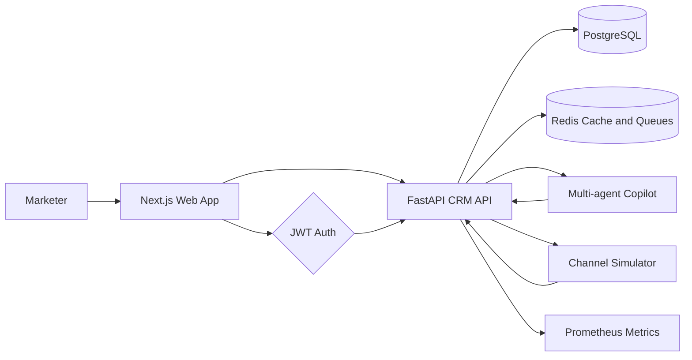
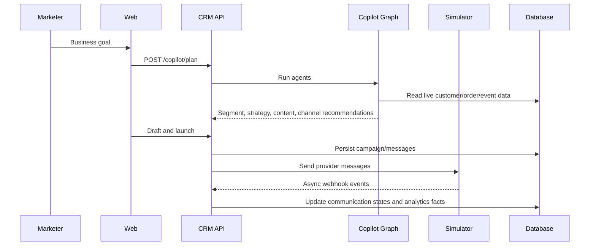
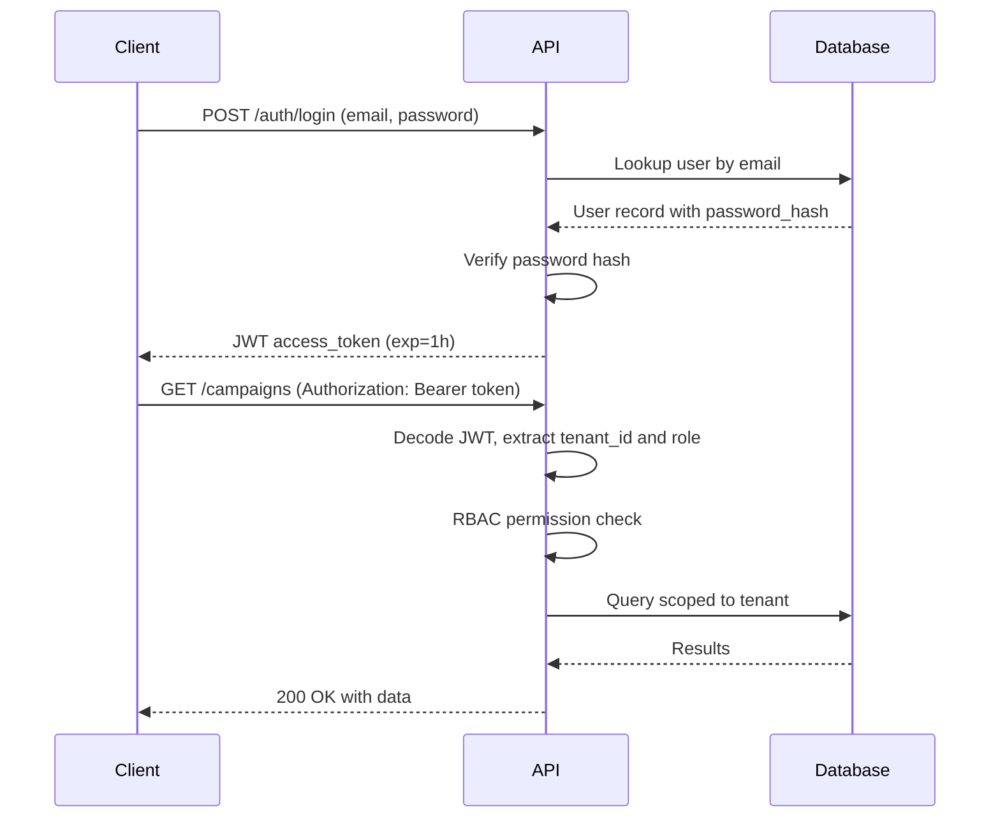
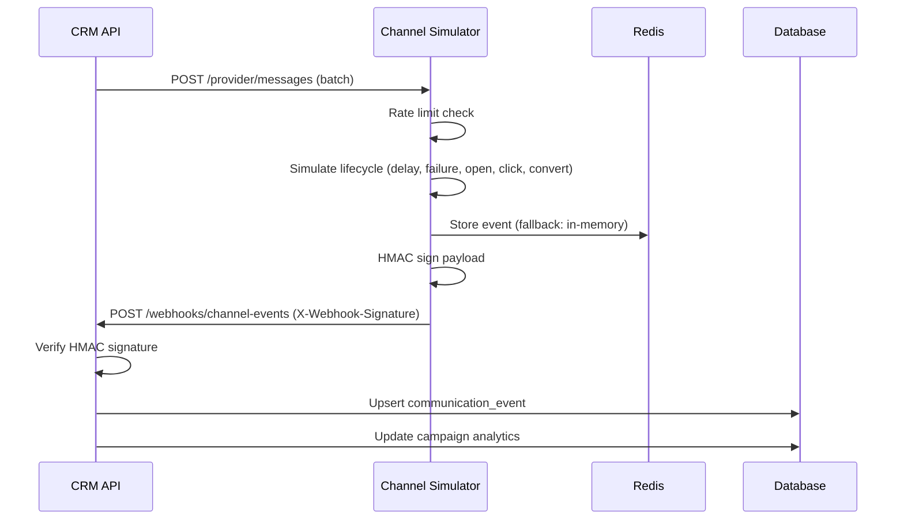
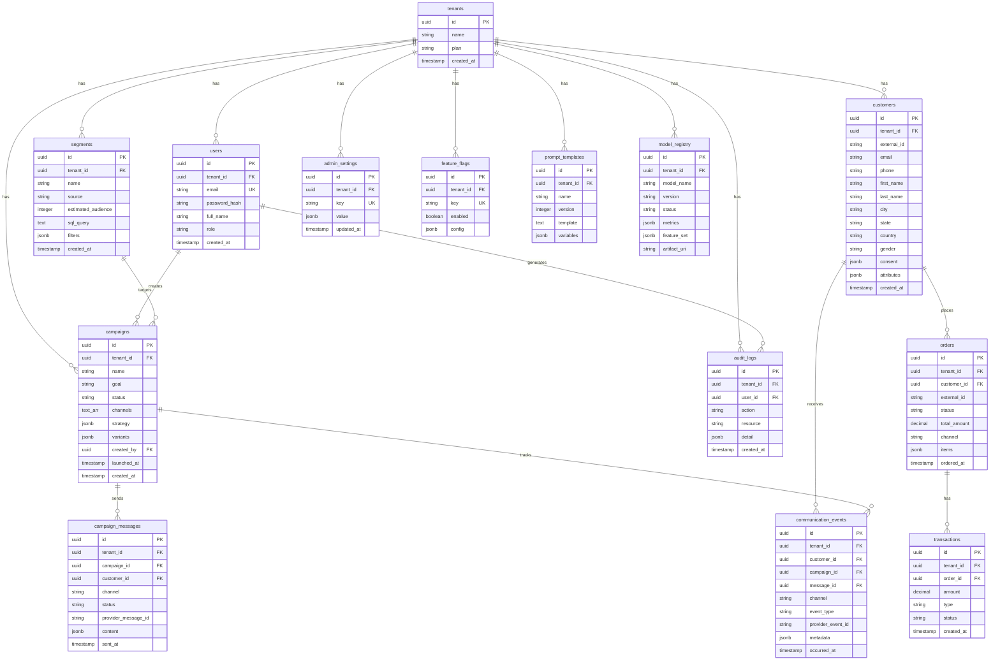
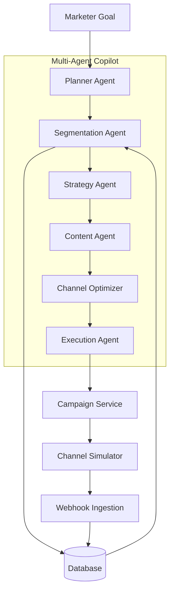
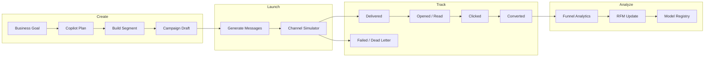

# Architecture

## System View

## Bounded Contexts

- Identity and access: tenants, users, roles, permissions.
- Customer data platform: customer, order, transaction, consent, attributes.
- Segmentation: visual filters, natural-language intent, SQL-safe compiler, audience estimates.
- Campaign orchestration: drafts, variants, channel plans, launches, provider delivery state.
- Channel simulation: provider receipts, delayed events, failures, retry behavior, dead letters.
- Analytics: funnels, RFM, attribution, CLV-ready facts, churn/model registry surfaces.
- AI copilot: segmentation, strategy, content, channel optimization, analytics, customer intelligence, autonomous execution.
- Admin configuration: prompt templates, feature flags, tenant settings, editable rules.

## Clean Architecture

The FastAPI service separates concerns by package:

- `domain`: SQLAlchemy entities that express business concepts.
- `infrastructure`: repositories and persistence adapters.
- `services`: application use cases such as segmentation and campaign launch.
- `agents`: marketing copilot orchestration.
- `interfaces`: HTTP schemas and FastAPI routes.

External systems are isolated behind adapters. The campaign service sends messages to the simulator over HTTP and receives provider state through versioned webhooks.

## AI-Native Flow

## Safe Segmentation

The segment compiler maps visual rules and natural language into a constrained SQL grammar. Only whitelisted fields and operators are accepted, every dynamic value is parameter bound, and every query is tenant scoped.

## Authentication Flow

JWT tokens carry the tenant ID and user role. The middleware extracts claims on every request and enforces RBAC before the route handler executes.

## Event Processing

The current local implementation uses async FastAPI background tasks in the simulator and transactional webhook ingestion in the CRM API. Redis is included for production queueing and cache expansion. A production deployment can route `messages.queued`, `provider.receipt`, and `campaign.optimization` events through Redis streams, Celery, Kafka, or a managed queue without changing domain models.

## Entity Relationship Diagram

## Component Interaction — Agent Pipeline

## Campaign Lifecycle Data Flow

## ML Readiness

The schema includes a `model_registry` table and facts needed for feature generation:

- RFM features from orders.
- Channel affinity from communication events.
- Conversion labels from campaign interactions.
- Customer attributes and consent state.
- Campaign strategy and variant metadata.

Experiment tracking, model versioning, and feature store integration can be added by connecting the model registry to MLflow, Feast, or a managed model registry.
